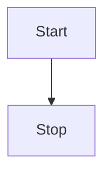

Everything about test test test test test test test 

# big header


## Second header


$$
x = \frac{-b\pm \sqrt{b^2 -4ac}}{2a}
$$

```python
def times_two(x):
    return x*2
```



<details open markdown="1">

  <summary>Click me</summary>
  
  1. Foo
  2. Bar
     * Baz
     * Qux

  ```js
  function logSomething(something) {
    console.log('Something', something);
    console.log("Something else", something)
  }
  ```

  test test

  hello2okay

</details>

| hello | hi   |
| :---- | :--- |
| hi    | hi   |

## Image

